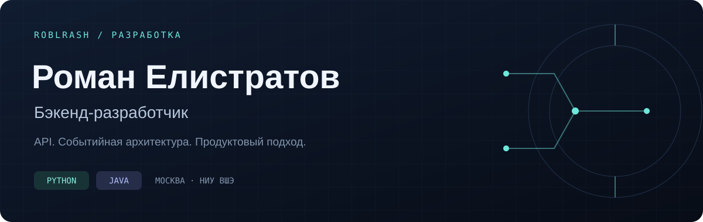

  

  
  
  

## Обо мне

Привет! Я Роман, бэкенд-разработчик из Москвы. Создаю API и сервисы на **Python и Java**. Люблю превращать продуктовые идеи в работающие приложения.

- **Т-Банк** — 6 месяцев стажировки в бэкенд-разработке на Python и FastAPI.
- **Победитель PROD** — 1-е место в командном финале; тимлид и разработчик.
- **ФКН НИУ ВШЭ** — учусь на программе «Дизайн и разработка информационных продуктов».
- **Интересы** — событийная архитектура, бэкенд, алгоритмы и практическая интеграция ИИ.

## Избранные проекты

<table>
<tr>
<td width="50%" valign="top">

### FraudCore
**Мониторинг транзакций и объяснимый скоринг**

Бэкенд на Java для асинхронной обработки банковских транзакций через Kafka, проверки антифрод-правил и работы аналитиков с подозрительными операциями.

JWT-аутентификация · аудит действий · Prometheus и Grafana

**Java 21 · Spring Boot · Kafka · PostgreSQL**

[Посмотреть код →](https://github.com/Roblrash/FraudCore)

</td>
<td width="50%" valign="top">

### BookIT
**Бронирование мест в коворкинге**

Командный проект финала PROD: бэкенд на FastAPI для бронирования рабочих мест, управления пользователями и администрирования.

Яндекс OAuth · интеграция с Telegram · S3-совместимое хранилище

**Python · FastAPI · PostgreSQL · Redis · Docker**

[Бэкенд →](https://github.com/Roblrash/2025-final-command-team-17-LokalkaTeamBackend) · [Фронтенд →](https://github.com/Roblrash/2025-final-command-team-17-LokalkaTeam-Frontend)

</td>
</tr>
</table>

<b>Другие проекты</b>

 

- [GeometryAPI](https://github.com/Roblrash/GeometryAPI) — REST API на ASP.NET Core для работы с геометрическими фигурами: DTO, валидация и Entity Framework Core.
- [PROD 2025 · Индивидуальный финал](https://github.com/Roblrash/2025-final-individual-Roblrash) — моё решение индивидуального финала.

## Технологии

| Направление | Стек |
| :--- | :--- |
| **Языки** | Python · Java · C++ |
| **Бэкенд** | FastAPI · Spring Boot · SQLAlchemy · Spring Data JPA |
| **Данные и обмен сообщениями** | PostgreSQL · Redis · Apache Kafka |
| **Инфраструктура** | Docker · Docker Compose · Git · MinIO / S3 |
| **Мониторинг** | Prometheus · Grafana |
| **Тестирование** | JUnit 5 · Mockito · Testcontainers |

## Сейчас в фокусе

Разрабатываю сервисы с понятными API, полезными тестами и мониторингом. Углубляю знания Java и Spring, изучаю, как интегрировать ИИ в продукты для решения реальных задач.

---

  <b>Давайте создавать полезные продукты.</b> 
  <a href="mailto:mr.roman.elistratov@mail.ru">mr.roman.elistratov@mail.ru</a>

